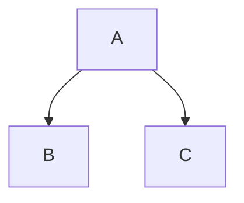

# SIDS data processing pipeline

## Intro
**Small Islands Developing States (SIDS)** is a group of island states spatially disjoint located all over the world.  
This data pipeline can be used to pre-process and generate the bulk of spatial data for the SIDS platform [geospatial application](https://sids-dashboard.github.io/SIDSDataPlatform/main.html)  
The pipeline computes zonal stats for a number of vector layers from a number of raster layers and converts  
the results into MapBox vector tiles (.pbf) and stores them in an Azure Blob storage container.  
The specs for the raster and vector files are fetched from CSV files stored in same Azure Blob storage.  
Both, the source and sink data is hosted inside and Azure Blob storage container managed by UNDP GeoAnalytics.

## Structure

The data pipeline consists of three blocks

### 1. Sources

The input consists of paths from where the ratser and vector CSV spec files are downlaoded.
Obviously a  Azure container SAS url is required to access the Azure container. This can be provided
either as a command line argument or an env varfiable SAS_SIDS_CONTAINER can be created to store the url

### 2. Processing

